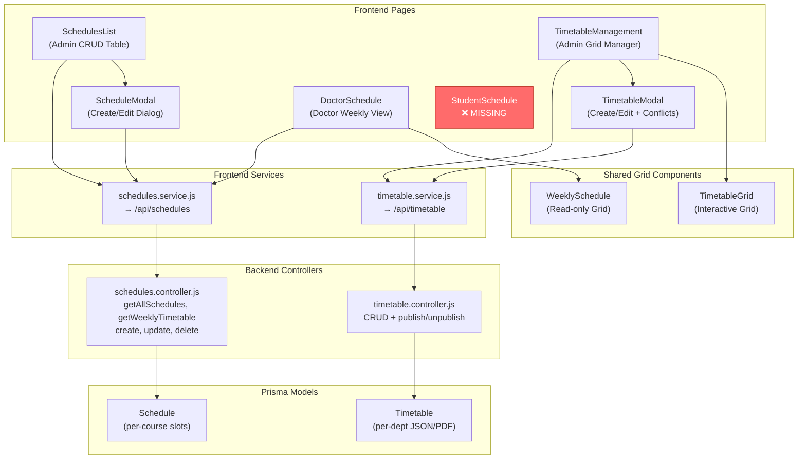

# 📋 Schedule/Timetable System — Full Analysis Report

> [!NOTE]
> This report covers **every** schedule-related file in the University Management System project — 20+ files analyzed across frontend components, backend APIs, database models, routing, i18n, and dashboard integration.

---

## 1. Complete File Inventory

### Frontend — Schedule Pages (7 components)

| File | Purpose |
|------|---------|
| [SchedulesList.jsx](file:///c:/Users/omar4/Desktop/University%20management%20system/frontend/src/pages/schedules/SchedulesList.jsx) | Admin CRUD table for schedule entries |
| [DoctorSchedule.jsx](file:///c:/Users/omar4/Desktop/University%20management%20system/frontend/src/pages/schedules/DoctorSchedule.jsx) | Doctor's personal weekly view |
| [ScheduleModal.jsx](file:///c:/Users/omar4/Desktop/University%20management%20system/frontend/src/pages/schedules/ScheduleModal.jsx) | Create/Edit schedule dialog |
| [TimetableGrid.jsx](file:///c:/Users/omar4/Desktop/University%20management%20system/frontend/src/pages/schedules/TimetableGrid.jsx) | Visual weekly grid component (core renderer) |
| [TimetableManagement.jsx](file:///c:/Users/omar4/Desktop/University%20management%20system/frontend/src/pages/schedules/TimetableManagement.jsx) | Admin timetable grid management page |
| [TimetableModal.jsx](file:///c:/Users/omar4/Desktop/University%20management%20system/frontend/src/pages/schedules/TimetableModal.jsx) | Create/Edit timetable entry (with conflict check) |
| [WeeklySchedule.jsx](file:///c:/Users/omar4/Desktop/University%20management%20system/frontend/src/pages/schedules/WeeklySchedule.jsx) | Read-only weekly grid viewer |

### Frontend — Services (2 files)

| File | Base URL | Methods |
|------|----------|---------|
| [schedules.service.js](file:///c:/Users/omar4/Desktop/University%20management%20system/frontend/src/services/schedules.service.js) | `/api/schedules` | `getAll`, `getById`, `getMySchedule`, `create`, `update`, `delete`, `getByDepartment` |
| [timetable.service.js](file:///c:/Users/omar4/Desktop/University%20management%20system/frontend/src/services/timetable.service.js) | `/api/timetable` | `getAll`, `getById`, `create`, `update`, `delete`, `getConflicts` |

### Frontend — Supporting Files

| File | Relevance |
|------|-----------|
| [App.jsx](file:///c:/Users/omar4/Desktop/University%20management%20system/frontend/src/App.jsx) | Route definitions for schedule pages |
| [App.tsx](file:///c:/Users/omar4/Desktop/University%20management%20system/frontend/src/App.tsx) | Parallel route definitions (same routes) |
| [Sidebar.jsx](file:///c:/Users/omar4/Desktop/University%20management%20system/frontend/src/components/layout/Sidebar.jsx) | Schedule menu items per role |
| [en.json](file:///c:/Users/omar4/Desktop/University%20management%20system/frontend/src/i18n/en.json) | English translations |
| [ar.json](file:///c:/Users/omar4/Desktop/University%20management%20system/frontend/src/i18n/ar.json) | Arabic translations |

### Backend — Controllers & Routes (4 files)

| File | Purpose |
|------|---------|
| [schedules.controller.js](file:///c:/Users/omar4/Desktop/University%20management%20system/backend/src/controllers/schedules.controller.js) | 5 functions: `getAllSchedules`, `getWeeklyTimetable`, `createSchedule`, `updateSchedule`, `deleteSchedule` |
| [timetable.controller.js](file:///c:/Users/omar4/Desktop/University%20management%20system/backend/src/controllers/timetable.controller.js) | 7 functions: `getTimetables`, `getTimetableById`, `createTimetable`, `updateTimetable`, `deleteTimetable`, `publishTimetable`, `unpublishTimetable` |
| [schedules.routes.js](file:///c:/Users/omar4/Desktop/University%20management%20system/backend/src/routes/schedules.routes.js) | 5 endpoints under `/api/schedules` |
| [timetable.routes.js](file:///c:/Users/omar4/Desktop/University%20management%20system/backend/src/routes/timetable.routes.js) | 7 endpoints under `/api/timetables` |

### Backend — Supporting Files

| File | Relevance |
|------|-----------|
| [schema.prisma](file:///c:/Users/omar4/Desktop/University%20management%20system/backend/prisma/schema.prisma) | `Schedule` model (L369–380) + `Timetable` model (L382–400) |
| [app.js](file:///c:/Users/omar4/Desktop/University%20management%20system/backend/src/app.js) | Mounts at `/api/schedules` and `/api/timetables` (plural) |
| [app.ts](file:///c:/Users/omar4/Desktop/University%20management%20system/backend/src/app.ts) | Mounts at `/api/schedules` and `/api/timetable` (**singular** ⚠️) |
| [scope.utils.js](file:///c:/Users/omar4/Desktop/University%20management%20system/backend/src/utils/scope.utils.js) | Role-based data scoping for `'schedule'` and `'timetable'` entities |
| [dashboard.controller.js](file:///c:/Users/omar4/Desktop/University%20management%20system/backend/src/controllers/dashboard.controller.js) | `todaySchedule` for admin, student, and doctor dashboards |

---

## 2. Database Models (Prisma Schema)

### `Schedule` Model — Per-Course Time Slots (L369–380)

```prisma
model Schedule {
  id        Int      @id @default(autoincrement())
  courseId   Int
  course    Course   @relation(fields: [courseId], references: [id])
  dayOfWeek String   // "Sunday", "Monday", etc.
  startTime String   // "09:00"
  endTime   String   // "11:00"
  room      String?
  createdAt DateTime @default(now())
  @@index([courseId])
}
```

### `Timetable` Model — Per-Department Whole Schedule (L382–400)

```prisma
model Timetable {
  id           Int             @id @default(autoincrement())
  collegeId    Int
  college      College         @relation(fields: [collegeId], references: [id])
  departmentId Int
  department   Department      @relation(fields: [departmentId], references: [id])
  academicYear Int             // Study Level: 1, 2, 3, 4
  semester     Int             // 1 or 2
  title        String
  description  String?
  scheduleData Json?           // JSON blob for dynamic schedule slots
  fileUrl      String?         // PDF/Image upload alternative
  status       TimetableStatus @default(DRAFT)
  createdAt    DateTime        @default(now())
  updatedAt    DateTime        @updatedAt
  @@unique([collegeId, departmentId, academicYear, semester])
  @@index([collegeId, departmentId])
}

enum TimetableStatus { DRAFT, PUBLISHED }
```

> [!IMPORTANT]
> **These are fundamentally different models**, not duplicates:
> - **`Schedule`**: Granular, per-course slot (course + day + time + room). Used for weekly grid views.
> - **`Timetable`**: Whole-department record (college + dept + year + semester) with a JSON blob or PDF upload. Used for bulk schedule management with draft/publish workflow.
> 
> They have **no foreign key relationship** to each other and serve different use cases, but this creates a fragmented system where data isn't shared.

---

## 3. Backend API Endpoints

### Schedule API (`/api/schedules`)

| Method | Path | Roles Allowed | Handler | Notes |
|--------|------|---------------|---------|-------|
| GET | `/api/schedules` | Any authenticated | `getAllSchedules` | Role-scoped filtering |
| GET | `/api/schedules/week` | Any authenticated | `getWeeklyTimetable` | Groups results by day of week |
| POST | `/api/schedules` | SUPER_ADMIN, ADMIN, COLLEGE_ADMIN, DEPT_ADMIN | `createSchedule` | ✅ Has room conflict detection |
| PUT | `/api/schedules/:id` | SUPER_ADMIN, ADMIN, COLLEGE_ADMIN, DEPT_ADMIN | `updateSchedule` | ⚠️ NO conflict detection |
| DELETE | `/api/schedules/:id` | SUPER_ADMIN, ADMIN, COLLEGE_ADMIN, DEPT_ADMIN | `deleteSchedule` | Scope-enforced |

### Timetable API (`/api/timetables`)

| Method | Path | Roles Allowed | Handler | Notes |
|--------|------|---------------|---------|-------|
| GET | `/api/timetables` | Any authenticated | `getTimetables` | Students see only PUBLISHED |
| GET | `/api/timetables/:id` | Any authenticated | `getTimetableById` | Scope-enforced |
| POST | `/api/timetables` | SUPER_ADMIN, ADMIN, COLLEGE_ADMIN, DEPT_ADMIN | `createTimetable` | Validates dept→college |
| PUT | `/api/timetables/:id` | SUPER_ADMIN, ADMIN, COLLEGE_ADMIN, DEPT_ADMIN | `updateTimetable` | Scope-enforced |
| DELETE | `/api/timetables/:id` | SUPER_ADMIN, ADMIN, COLLEGE_ADMIN, DEPT_ADMIN | `deleteTimetable` | Scope-enforced |
| PATCH | `/api/timetables/:id/publish` | SUPER_ADMIN, ADMIN, COLLEGE_ADMIN, DEPT_ADMIN | `publishTimetable` | ⚠️ NO scope enforcement |
| PATCH | `/api/timetables/:id/unpublish` | SUPER_ADMIN, ADMIN, COLLEGE_ADMIN, DEPT_ADMIN | `unpublishTimetable` | ⚠️ NO scope enforcement |

---

## 4. Frontend Routes & Navigation

### Route Definitions (App.jsx)

| Route Path | Component | Allowed Roles |
|------------|-----------|---------------|
| `/schedules` | `SchedulesList` | super_admin, admin |
| `/schedules/create` | `ScheduleModal` | super_admin, admin |
| `/schedules/edit/:id` | `ScheduleModal` | super_admin, admin |
| `/my-schedule` | `DoctorSchedule` | **doctor only** |
| `/timetable` | `TimetableManagement` | super_admin, admin |

### Sidebar Menu Items (Sidebar.jsx)

| Label | Path | Visible To |
|-------|------|------------|
| Schedules | `/schedules` | super_admin, admin |
| My Schedule | `/my-schedule` | **doctor only** |
| Timetable | `/timetable` | super_admin, admin |

> [!CAUTION]
> **Students have ZERO access** — no route, no sidebar item, no component. Even though the backend's `getWeeklyTimetable` and `getAllSchedules` endpoints support student role filtering (auto-filtered to enrolled courses via dept + year + semester).

---

## 5. Role Coverage Matrix

| Capability | Super Admin | Admin | College Admin | Dept Admin | Doctor | Student |
|-----------|:-----------:|:-----:|:-------------:|:----------:|:------:|:-------:|
| **Schedule CRUD (table view)** | ✅ | ✅ | ✅ (backend) | ✅ (backend) | ❌ | ❌ |
| **Timetable CRUD (grid manager)** | ✅ | ✅ | ✅ (backend) | ✅ (backend) | ❌ | ❌ |
| **View weekly schedule** | ❌ | ❌ | ❌ | ❌ | ✅ | ❌ **MISSING** |
| **Backend read access** | ✅ | ✅ | ✅ | ✅ | ✅ | ✅ |
| **Sidebar menu item** | ✅ | ✅ | ? | ? | ✅ | ❌ **MISSING** |
| **Dashboard schedule widget** | ✅ | ✅ | ✅ | ✅ | ✅ | ✅ |
| **Publish/Unpublish timetable** | ✅ | ✅ | ✅ | ✅ | ❌ | ❌ |

---

## 6. UI Quality Assessment

### `TimetableGrid.jsx` — ⭐⭐⭐⭐ Good
- ✅ Proper CSS Grid: days as columns (Sat–Fri), hourly rows (8 AM – 6 PM)
- ✅ Color-coded course blocks positioned by start/end time
- ✅ Course name + doctor + room visible in each block
- ✅ Hover tooltip with full details
- ✅ Current time indicator line
- ✅ Responsive: collapses to single-day view on mobile
- ✅ RTL support via CSS `direction` property

### `WeeklySchedule.jsx` — ⭐⭐⭐⭐ Good
- ✅ Read-only weekly grid (used by `DoctorSchedule`)
- ✅ Color-coded lecture blocks
- ✅ Current day highlight
- ✅ Print-friendly styles
- ✅ Responsive: single-day collapse on mobile
- ✅ RTL/i18n fully supported

### `SchedulesList.jsx` — ⭐⭐ Basic
- ⚠️ Flat data table, NOT a timetable grid
- ✅ MUI responsive table with CRUD actions
- This is an admin management list, not a visual schedule

### i18n / Bilingual Support — ✅ Complete
- All components use `useTranslation()` hook
- Complete English key coverage (`schedule.*`, `timetable.*`)
- Complete Arabic key coverage with matching keys
- RTL layout supported in grid components
- Day names are translated

---

## 7. Architecture Diagram



---

## 8. All Bugs & Issues Found

### 🔴 Critical

| # | Issue | Location |
|---|-------|----------|
| 1 | **Student schedule view completely missing on frontend** — no route, no component, no sidebar item | [App.jsx](file:///c:/Users/omar4/Desktop/University%20management%20system/frontend/src/App.jsx), [Sidebar.jsx](file:///c:/Users/omar4/Desktop/University%20management%20system/frontend/src/components/layout/Sidebar.jsx) |
| 2 | **`app.js` vs `app.ts` mount path mismatch** — timetable is mounted at `/api/timetables` (plural) in app.js but `/api/timetable` (singular) in app.ts | [app.js L152,164](file:///c:/Users/omar4/Desktop/University%20management%20system/backend/src/app.js), [app.ts L168,180](file:///c:/Users/omar4/Desktop/University%20management%20system/backend/src/app.ts) |
| 3 | **`publishTimetable` and `unpublishTimetable` have NO scope enforcement** — any admin role can publish/unpublish ANY college's timetable | [timetable.controller.js](file:///c:/Users/omar4/Desktop/University%20management%20system/backend/src/controllers/timetable.controller.js) |

### 🟡 Moderate

| # | Issue | Location |
|---|-------|----------|
| 4 | **`updateSchedule` skips conflict detection** — `createSchedule` validates room conflicts but `updateSchedule` does not | [schedules.controller.js](file:///c:/Users/omar4/Desktop/University%20management%20system/backend/src/controllers/schedules.controller.js) |
| 5 | **Dashboard `next` not defined** — `getStudentStats` and `getDoctorStats` reference `next` but it's not a handler parameter; will throw ReferenceError | [dashboard.controller.js](file:///c:/Users/omar4/Desktop/University%20management%20system/backend/src/controllers/dashboard.controller.js) |
| 6 | **Timetable controller uses wrong scope entity** — calls `getScopeWhere(user, 'department')` instead of `'timetable'`, making the `'timetable'` scope definitions in scope.utils.js unused | [timetable.controller.js](file:///c:/Users/omar4/Desktop/University%20management%20system/backend/src/controllers/timetable.controller.js), [scope.utils.js](file:///c:/Users/omar4/Desktop/University%20management%20system/backend/src/utils/scope.utils.js) |
| 7 | **Two parallel systems not integrated** — `Schedule` (slot-based) and `Timetable` (JSON/PDF) never cross-reference each other | [schema.prisma L369-400](file:///c:/Users/omar4/Desktop/University%20management%20system/backend/prisma/schema.prisma) |
| 8 | **`App.jsx` and `App.tsx` coexist** — both define identical routes; unclear which is active | Frontend root |

### 🟢 Minor

| # | Issue | Location |
|---|-------|----------|
| 9 | Double `protect` middleware on timetable routes (router-level + app-level) — redundant but harmless | [timetable.routes.js](file:///c:/Users/omar4/Desktop/University%20management%20system/backend/src/routes/timetable.routes.js) |
| 10 | No pagination on `getTimetables` list endpoint | [timetable.controller.js](file:///c:/Users/omar4/Desktop/University%20management%20system/backend/src/controllers/timetable.controller.js) |
| 11 | `getWeeklyTimetable` duplicates 90% of `getAllSchedules` logic — DRY violation | [schedules.controller.js](file:///c:/Users/omar4/Desktop/University%20management%20system/backend/src/controllers/schedules.controller.js) |
| 12 | No semester/year filter on Doctor's schedule view | [DoctorSchedule.jsx](file:///c:/Users/omar4/Desktop/University%20management%20system/frontend/src/pages/schedules/DoctorSchedule.jsx) |

---

## 9. What Works ✅

1. **Admin/SuperAdmin CRUD** — Full create, read, update, delete for both schedule entries and timetable records
2. **Doctor weekly view** — Proper visual weekly grid with color-coded courses via `WeeklySchedule`
3. **Visual timetable management** — `TimetableManagement` page with interactive `TimetableGrid` component
4. **Conflict detection on create** — `createSchedule` validates room+day+time conflicts before saving
5. **Draft/Publish workflow** — Timetable model supports DRAFT → PUBLISHED status transitions
6. **Dashboard integration** — Today's schedule appears on admin, doctor, and student dashboards
7. **i18n complete** — Full Arabic + English translations for all schedule-related UI text
8. **RTL support** — Grid components flip direction for Arabic
9. **Responsive design** — Grid components collapse to single-day view on mobile
10. **Role-scoped data** — Admins see only their college's schedules; students auto-filtered by enrollment

---

## 10. Recommended Fix Roadmap

| Priority | Fix | Effort | Impact |
|----------|-----|--------|--------|
| 🔴 P0 | **Add Student schedule page** — create `StudentSchedule.jsx` (reuse `WeeklySchedule`), add route + sidebar entry | ~1 hour | Unblocks a whole user role |
| 🔴 P1 | **Fix app.js/app.ts mount path mismatch** — standardize to `/api/timetables` (plural) | ~10 min | Prevents 404 errors |
| 🔴 P2 | **Add scope enforcement to publish/unpublish** | ~20 min | Security fix |
| 🟡 P3 | **Add conflict detection to `updateSchedule`** | ~30 min | Data integrity |
| 🟡 P4 | **Fix dashboard `next` ReferenceError** | ~10 min | Prevents crash |
| 🟡 P5 | **Clean up App.jsx/App.tsx duality** — keep one, delete the other | ~30 min | Maintainability |
| 🟢 P6 | Add pagination to timetable list endpoint | ~30 min | Performance |
| 🟢 P7 | Add semester/year filter to doctor schedule view | ~30 min | UX improvement |
