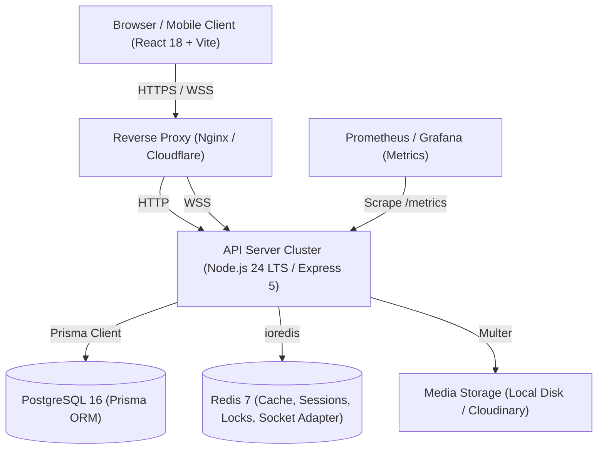

# System Architecture

This document describes the production architecture of the University Management System (UMS) following the Phase 7 architectural consolidation and Phase 8 repository cleanup.

---

## 1. High-Level Architecture

The University Management System is structured as a full-stack, multi-tenant academic operations platform composed of:



---

## 2. Core Components

### 2.1 Frontend Application (`artifacts/university-app`)
- **Framework:** React 18 with Vite 7 as the bundler.
- **Styling & UI:** Tailwind CSS v4 with custom enterprise tokens (navy and lime-green palette) and Radix UI primitives.
- **Internationalization:** Full Arabic (RTL) primary support with English language switching via `i18next`.
- **State & Data Fetching:** React Hooks, Axios API client with automatic token refresh, React Query for server cache.
- **Routing:** React Router v6 with client-side capability and role guards.

### 2.2 Backend API Server (`artifacts/api-server`)
- **Runtime:** Node.js 24 LTS running in native ECMAScript Modules (`"type": "module"`).
- **Framework:** Express 5.
- **Entrypoint:** Unified startup via `src/bootstrap.ts` (invoked by `src/index.ts`).
- **Validation:** Dual-layer validation utilizing `express-validator` at the HTTP boundary and `@workspace/api-zod` for contract models.
- **Security Middleware:** Helmet (Content Security Policy, strict headers), CORS origin validation, tiered Redis-backed rate limiters.

### 2.3 Persistence Layer (`PostgreSQL 16` + `Prisma v6`)
- **Authoritative ORM:** Prisma ORM v6 is the sole database data-access layer.
- **Migrations:** Managed exclusively via Prisma schema migrations in `artifacts/api-server/prisma/migrations`.
- **Precision:** Financial and grading entities utilize PostgreSQL `Decimal(10, 2)` to eliminate floating-point drift.
- **Integrity:** Strict foreign key relations, unique compound constraints, and protective application guards against destructive cascades.

### 2.4 Distributed Cache & State Coordination (`Redis 7`)
- **Rate Limiting:** Sliding-window rate limit stores (`rate-limit-redis`) across authentication and sensitive endpoints.
- **Real-Time Scaling:** Socket.IO Redis adapter (`@socket.io/redis-adapter`) synchronizing broadcast events across multi-instance API deployments.
- **Distributed Cron Locks:** Redlock-style distributed locking (`src/utils/distributedLock.utils.ts`) ensuring scheduled background jobs run on exactly one worker instance.
- **Session Revocation:** Fast invalidation and token epoch lookups.

### 2.5 Real-Time Communication (`Socket.IO 4.8`)
- **Transports:** WebSocket with polling fallback.
- **Rooms & Scopes:** Granular channels for user notifications, live attendance sessions, and administrative alerts.
- **Security:** Handshake authentication verifying JWT access tokens and active user account state before socket binding.

### 2.6 Background Job Scheduling
- **Engine:** `node-cron` coordinated through Redis distributed locks.
- **Jobs:**
  1. `academicRiskScheduler`: Nightly computation of student academic warning thresholds scoped to active offerings.
  2. `sessionTimeoutScheduler`: Auto-closure of expired attendance sessions.
  3. `backupVerificationScheduler`: Periodic verification and heartbeat telemetry.

### 2.7 Observability & Telemetry
- **Correlation:** Every inbound request is tagged with an `X-Request-Id` UUID header propagated to logs, error reports, and client responses.
- **Structured Logging:** Winston JSON logs masking credentials, tokens, and PII.
- **Error Tracking:** Sentry SDK integration with request-id tagging.
- **Prometheus Metrics:** Standard `/metrics` endpoint with token-protected scraper access.

---

## 3. Workspace Structure

The repository is organized as a pnpm monorepo:

```
├── artifacts/
│   ├── api-server/         # Express 5 backend, Prisma schema, tests
│   └── university-app/     # React 18 Vite frontend application
├── lib/
│   ├── api-client-react/   # Generated React client hooks
│   ├── api-spec/           # Generated OpenAPI specifications
│   └── api-zod/            # Shared Zod validation schemas
├── docs/
│   ├── audits/             # Historical audits & compliance archives
│   ├── operations/         # Production runbooks (backup, disaster recovery, rollback)
│   ├── ARCHITECTURE.md     # Architecture documentation (this file)
│   ├── AUTHORIZATION.md    # Roles and tenant scoping model
│   ├── API.md              # API design, OpenAPI contracts, conventions
│   ├── DATABASE.md         # Database conventions and migration guidelines
│   ├── ENVIRONMENT.md      # Environment variable specifications
│   ├── OPERATIONS.md       # Operational index and health probes
│   ├── SECURITY.md         # Security architecture and controls
│   └── TROUBLESHOOTING.md  # Incident diagnosis and remediation runbooks
├── scripts/                # Build, test, migration, and operational utilities
├── compose.yaml            # Production multi-container Docker Compose definition
├── package.json            # Root monorepo workspace configuration
└── pnpm-workspace.yaml     # pnpm workspace definition
```

---

## 4. Technical Debt & Non-Blocking Items

As documented during Phase 7 architectural consolidation:
1. **Gradual Type Refinement:** Unsafe `any` casts have been completely removed from critical boundaries (services, controllers, domain entities). Non-blocking type loosening remains in low-risk internal UI utilities and mocks.
2. **UI Component Decomposition:** Giant UI pages (`CourseDetails.tsx`, `StudentDetails.tsx`) have had critical hooks stabilized, with further granular presentation component extraction planned for future iterations.
3. **OpenAPI Auxiliary Expansion:** Core operational endpoints are fully mapped in OpenAPI; auxiliary legacy administrative endpoints will continue expanding into generated schemas.
