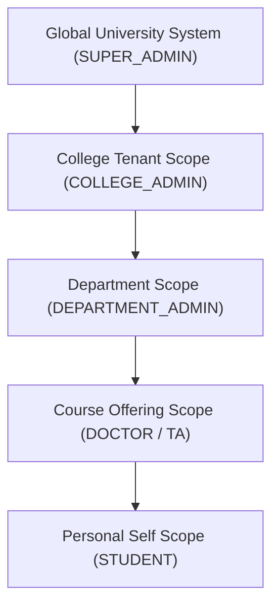

# Authorization and Role Scoping Architecture

This document specifies the role-based access control (RBAC) and multi-tenant isolation model enforced by the University Management System.

---

## 1. Architectural Philosophy

> [!IMPORTANT]
> **Authoritative Boundary Rule:**
> Frontend capability checks (conditional UI elements, disabled buttons, menu filtering) are strictly for user experience (UX) convenience.
> **All authorization, tenant scoping, and permission evaluations are strictly and authoritatively enforced by backend middleware on every HTTP request and Socket.IO event.**

No client payload can grant permissions, bypass college or department tenant boundaries, or manipulate entities outside the user's verified administrative or academic scope.

---

## 2. User Roles & Capabilities

The system defines 7 distinct roles across system administration, faculty, and students:

### 2.1 `SUPER_ADMIN`
- **Scope:** Global / University-wide.
- **Capabilities:**
  - Full oversight across all Colleges, Departments, Courses, and Users.
  - System configuration and environment monitoring.
  - Access to protected operational endpoints (e.g. `/metrics`).
  - Creation and management of College Admins and system-level policies.

### 2.2 `ADMIN`
- **Scope:** System administration (retained for backward compatibility).
- **Capabilities:** Operational administrative tasks under Super Admin policies.

### 2.3 `COLLEGE_ADMIN`
- **Scope:** Strictly scoped to their designated College (`collegeId`).
- **Capabilities:**
  - Manage departments, faculty, staff, and students within their assigned College.
  - Configure college-level academic schedules, classrooms, and buildings.
  - View aggregate academic reports and risk metrics within their College.
  - **Restriction:** Completely blocked from reading or mutating data belonging to other Colleges.

### 2.4 `DEPARTMENT_ADMIN`
- **Scope:** Scoped to their designated Department (`departmentId`) within a College.
- **Capabilities:**
  - Manage course offerings, student study plans, and staff assignments in their department.
  - Approve enrollment requests and timetable allocations.
  - **Restriction:** Strictly barred from reading or mutating records in sibling or parent departments.

### 2.5 `DOCTOR` (Faculty Professor)
- **Scope:** Scoped to assigned course offerings (`DoctorCourse`).
- **Capabilities:**
  - Create and manage course content, assignments, quizzes, and exams for assigned sections.
  - Launch and oversee live interactive attendance sessions (QR code, GPS geofencing, RFID).
  - Submit and approve course grades and absence warning exemptions.
  - **Restriction:** Read-only or no access to courses where they are not assigned instructors.

### 2.6 `TEACHING_ASSISTANT` (TA)
- **Scope:** Scoped to assigned practical/tutorial sections (`TeachingAssistantCourse`).
- **Capabilities:**
  - Mark and review attendance records for assigned course sections.
  - Grade student homework and laboratory task submissions.
  - View enrolled student rosters for assigned practical sessions.

### 2.7 `STUDENT`
- **Scope:** Strictly self-scoped (`userId`).
- **Capabilities:**
  - Register/enroll in offered courses based on major and prerequisite rules.
  - View personal timetable, academic transcript, GPA, and tuition fees.
  - Record attendance via active QR scanner or GPS geofence matching.
  - Submit homework assignments and complete timed quizzes/exams.
  - **Restriction:** Zero visibility into peer records, grades, submissions, or administrative data.

---

## 3. Multi-Tenant Scoping Boundaries

The data model enforces multi-tenancy at five distinct boundary layers:

### Boundary Enforcement Rules:
1. **College Boundary:** Requests targeting a College entity require matching `req.user.collegeId` unless actor is `SUPER_ADMIN`.
2. **Department Boundary:** Requests targeting Department entities or departmental rosters must verify `req.user.departmentId`.
3. **Course Offering Boundary:** Faculty access requires verified assignment in `DoctorCourse` or `TeachingAssistantCourse` for the active term.
4. **Enrollment Boundary:** Student operations (exam submission, attendance marking) require active `Enrollment` in the target course offering.
5. **Token Epoch / Revocation:** Any role change, password reset, or account deactivation increments the user's `tokenVersion`, instantly invalidating active access and refresh tokens across all clusters.
